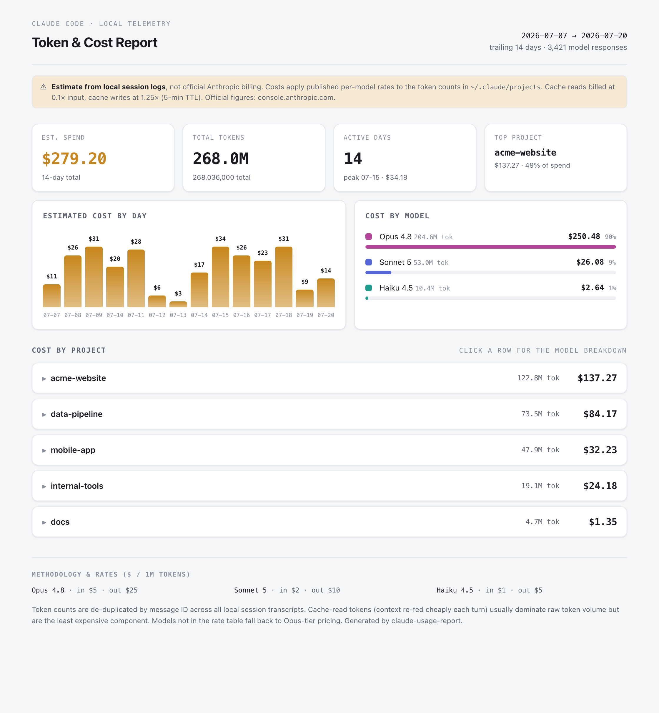

<div align="center">

# claude-usage-report

**A local token & cost dashboard for [Claude Code](https://claude.com/claude-code) — spend by day, model, and project, from the logs already on your machine.**

[](LICENSE)
[](claude_usage.py)
[](claude_usage.py)
[](#requirements)
[](https://claude.com/claude-code)

<picture>
  <source media="(prefers-color-scheme: dark)" srcset="assets/preview-dark.png">
  
</picture>

</div>

Claude Code keeps a transcript of every session under `~/.claude/projects/`, with token usage baked into each model response. This tool reads those transcripts, aggregates a trailing window, applies published per-model list prices, and writes one self-contained HTML dashboard — then opens it in your browser.

```
$ python3 claude_usage.py
Scanning /Users/you/.claude/projects (last 30 days)...
  3,421 model responses · 268.0M tokens · est. $279.20
Report written to /Users/you/claude-usage-report/claude-usage-report.html
```

One script, no dependencies, no network calls. Nothing leaves your machine.

## Features

- **Estimated spend** — headline total for the window, plus cost by day with peak-day callout
- **Cost by model** — every model that ran, with token volume, dollar share, and share bars
- **Cost by project** — ranked rows; click any row to expand a per-model breakdown with a stacked bar of where the tokens went (output / input / cache write / cache read)
- **Honest methodology** — the rate table and cache multipliers used are printed in the report footer, and the page is labeled as an estimate, not a bill
- **Renders anywhere, forever** — the report is fully static HTML (zero JavaScript, native `<details>` expanders), with light and dark themes following your OS

> [!NOTE]
> Everything is computed from the JSONL transcripts Claude Code already writes — no daemon, no API calls, no telemetry. Responses are de-duplicated by message ID, so streamed and retried events aren't double-counted.

## Installation

**One-liner** — fetch the script and run it:

```bash
curl -fsSL https://raw.githubusercontent.com/ClearMountainDigital/claude-usage-report/main/claude_usage.py -o claude_usage.py && python3 claude_usage.py
```

**Clone and run:**

```bash
git clone https://github.com/ClearMountainDigital/claude-usage-report.git
cd claude-usage-report
python3 claude_usage.py
```

**Manual:** download [`claude_usage.py`](claude_usage.py), put it anywhere, run `python3 claude_usage.py`.

On Windows, use `py -3 claude_usage.py` if `python3` isn't on your PATH.

## Requirements

| Need | Why | Install |
|---|---|---|
| Python 3.7+ | Runs the script (stdlib only) | Preinstalled on macOS/Linux · [python.org](https://python.org) on Windows |
| Claude Code with local history | The data source (`~/.claude/projects/**/*.jsonl`) | Already there if you've used Claude Code |
| Any browser | Views the generated report | — |

No pip packages, no `jq`, no Node.

## Anatomy

| Section | What it shows |
|---|---|
| **KPI row** | Estimated spend, total tokens, active days (with peak day), top project by cost |
| **Estimated cost by day** | Bar chart across the window; labels thin out automatically on wide windows |
| **Cost by model** | Per-model cost, token volume, and percent of total spend |
| **Cost by project** | Ranked, expandable rows — each opens into per-model lines with a stacked token-type bar and legend |
| **Methodology & rates** | The exact $/1M rates applied, cache multipliers, and de-duplication notes |

## Options

| Flag | Default | Purpose |
|---|---|---|
| `--days N` | `30` | Trailing window size |
| `--out PATH` | `./claude-usage-report.html` | Where to write the report |
| `--no-open` | off | Don't launch the browser after writing |
| `--claude-dir PATH` | `~/.claude/projects` | Non-standard Claude Code data location |

## Updating prices

Rates change. They live in one dict at the top of [`claude_usage.py`](claude_usage.py), in dollars per 1M tokens, with the last-checked date in the comment:

```python
RATES = {
    "claude-opus-4-8":  (5.0, 25.0),   # (input, output)
    "claude-sonnet-5":  (2.0, 10.0),   # intro pricing through 2026-08-31
    "claude-haiku-4-5": (1.0, 5.0),
    # ...
}
```

Cache writes bill at 1.25× input (the 5-minute-TTL rate Claude Code uses); cache reads at 0.1× input. Models missing from the table fall back to Opus-tier pricing and are marked `(default)` in the report footer — add a row when a new model ships.

> [!TIP]
> Cache reads usually dominate raw token volume (Claude Code re-feeds conversation context from the prompt cache every turn) but are the cheapest component by far. If your headline token count looks enormous next to the dollar figure, that's why.

## Troubleshooting

| Symptom | Fix |
|---|---|
| `No Claude Code logs found at ...` | Claude Code stores data elsewhere on your machine — pass `--claude-dir /path/to/.claude/projects` |
| `No usage found in the last N days` | Fresh install or long idle stretch — widen the window with `--days 90` |
| `python3: command not found` (Windows) | Use `py -3 claude_usage.py` |
| Numbers don't match my Anthropic invoice | Expected — this is list-price math over local logs. Plans, credits, and batch discounts aren't visible locally. Official numbers: [console.anthropic.com](https://console.anthropic.com) |
| A model shows `(default)` in the footer | It's missing from `RATES` — add its prices to the dict |
| Report shows fewer active days than expected | Only days with logged usage appear; the chart doesn't pad empty days |

## How it works

Claude Code appends a JSON line per event to `~/.claude/projects/<project>/<session>.jsonl`. Each assistant message carries a `usage` object with `input_tokens`, `output_tokens`, `cache_creation_input_tokens`, and `cache_read_input_tokens`. The script walks every transcript, keeps events inside the window, de-duplicates by `(message id, output tokens)` so streamed chunks and retries count once, buckets by local calendar day, and multiplies by the rate table. Project folder names are made readable by stripping your home directory and whatever path prefix all your projects share.

The report is generated as plain HTML with inline CSS — no JavaScript, no external assets — so it renders identically in any browser, email, or archive, and can't break when a CDN or script policy changes.

The preview images above are generated from **sample data** by [`assets/make_preview.py`](assets/make_preview.py); your report will show your own projects.

## Uninstall

```bash
# it's just files — remove the folder and any reports you generated
rm -rf claude-usage-report/
```

<div align="center">

**[MountainLabs.ai](https://mountainlabs.ai)** · [MIT](LICENSE)

</div>
